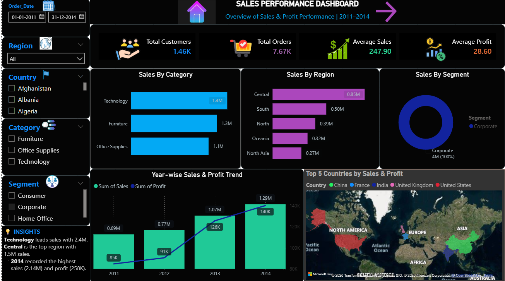
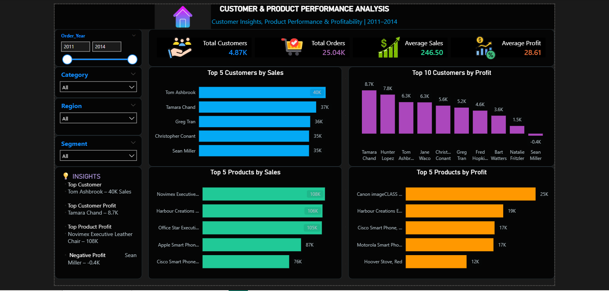

# Global Superstore Sales Analysis

## 📊 Project Overview

A **data analytics portfolio project** focused on analysing Global Superstore sales data to understand **sales performance, profitability, customer behaviour, product categories, and regional trends**.

The project uses **Python, MySQL, and Power BI** to clean, analyse, and visualize the data.

## 🛠️ Tools Used

* **Python** – Data cleaning and analysis
* **MySQL** – SQL queries and business analysis
* **Power BI** – Interactive dashboard and visualization

## 🎯 Key Analysis

* Sales and profit performance
* Category-wise sales analysis
* Region-wise sales analysis
* Customer analysis
* Order analysis
* Product performance
* Monthly sales trends
* Profitability analysis

## 📌 Key KPIs

| KPI             |  Value |
| --------------- | -----: |
| Total Sales     | 12.64M |
| Total Profit    |  1.47M |
| Total Orders    | 25,035 |
| Total Customers |  4,873 |
| Average Sales   | 246.50 |
| Average Profit  |  28.61 |

## 📈 Category Performance

| Category        | Sales |
| --------------- | ----: |
| Technology      | 4.74M |
| Furniture       | 4.11M |
| Office Supplies | 3.79M |

## 📊 Power BI Dashboard

### 🔹 SALES PERFORMANCE DASHBOARD

### 🔹 CUSTOMER AND PRODUCT PERFORMANCE DASHBOARD

## 🐍 Python Analysis

Python was used for data preparation and cleaning, including:

* Data cleaning
* Handling data types
* Date conversion
* Preparing data for analysis
* Exploratory data analysis

## 🗄️ MySQL Analysis

MySQL was used to perform SQL-based business analysis.

The analysis included:

* Sales and profit analysis
* Category and region analysis
* Customer analysis
* Order analysis
* Product performance
* Aggregation and filtering
* SQL business questions

### 📂 SQL File

👉 **[View Complete MySQL Queries](GlobalSuperStoreMySql.sql)**

## 💡 Key Insights

* **Technology** generated the highest category sales.
* The business generated **12.64M in total sales** and **1.47M in total profit**.
* Customer and order-level analysis helped identify sales and profitability patterns.
* Power BI dashboards provided an interactive view of overall business performance.

## 👩‍💻 Project Details

**Project Type:** Data Analytics Portfolio Project
**Dataset:** Global Superstore
**Tools:** Python | MySQL | Power BI
**Author:** Rekha M
**Year:** 2026
